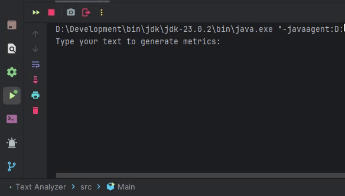

## Text Analyzer

Enquanto migrava para JAVA, busquei aprender conceitos mais avançados que não conseguia expandir em JavaScript, como POO, gerenciamento de memória, threads, entre outros. para fixar os conhecimentos decidi criar pequenos projetos, um desses projetos é um analisador de textos. O usuário pode inserir um texto (futuramente também arquivos) e visualizar diversas informações, como quantidade de bytes, palavras, caracteres, números e letras.

### 💡 Inspiração
Pequenos projetos como este podem servir de inspiração, para que futuramente eu possa visualizá-los e perceber que consegui me consolidar nessa nova linguagem, usar todos os seus conhecimentos ou uma boa parte dele em um novo projeto ajuda bastante a fixar ideias é conceitos facilmente

### ✅ Funcionalidades Implementadas
Pode analisar um texto processado do usuario e obter:

- [x]  Quantidade de bytes, caracteres, letras, numeros e espaços em branco do texto

### 🚧 Funcionalidades Futuras

- [ ]  Quantidade total de palavras, linhas, letras maisculas & minusculas e caracteres especiais
- [ ]  Palavras mais & menos usadas com suas porcentagens e quantidade de usos
- [ ]  Analisar arquivos .txt 
- [ ]  Gerar outro arquivo .txt ou .pdf com as informações

### 📘 Habilidades
- Manipulação de Strings, usando filtros
- Funções anonimas com lambda
- Classes abstratas com metodos concretos
- Processar prompt do usúario
